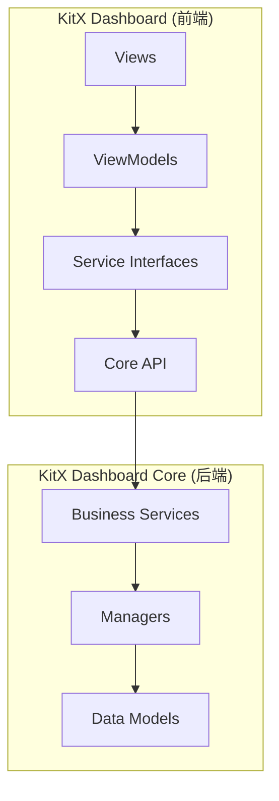

# KitX Dashboard 前后端分离架构设计文档

## 1. 概述

本方案将KitX Dashboard拆分为：
- **前端**：KitX Dashboard (UI层)
- **后端**：KitX Dashboard Core (业务逻辑层)

## 2. 架构设计



## 3. 职责划分

### 后端(Core项目)
- 所有业务逻辑处理
- 数据管理和持久化
- 网络通信
- 插件管理
- 安全配置
- 统计和日志

### 前端(Dashboard项目)
- 用户界面展示
- 用户交互处理
- 视图状态管理
- 通过接口调用后端服务

## 4. 实施步骤

1. **重构Core项目**
   - 改为类库项目
   - 设计服务接口层
   - 建立DI容器

2. **代码迁移**
   - 迁移Models、Managers、Services等

3. **接口设计**
   - 定义服务接口
   - 实现服务类
   - 创建服务工厂

4. **前端适配**
   - 重构ViewModels
   - 实现服务代理
   - 更新DI配置

## 5. 目录结构

```
KitX Dashboard Core/
├── Interfaces/
├── Services/
├── Models/
├── Managers/
└── Extensions/

KitX Dashboard/
├── Views/
├── ViewModels/
├── ServiceProxies/
└── Locators/
```

## 6. 后续计划

- 按阶段实施迁移
- 逐步测试验证
- 完善文档
