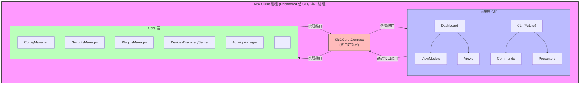
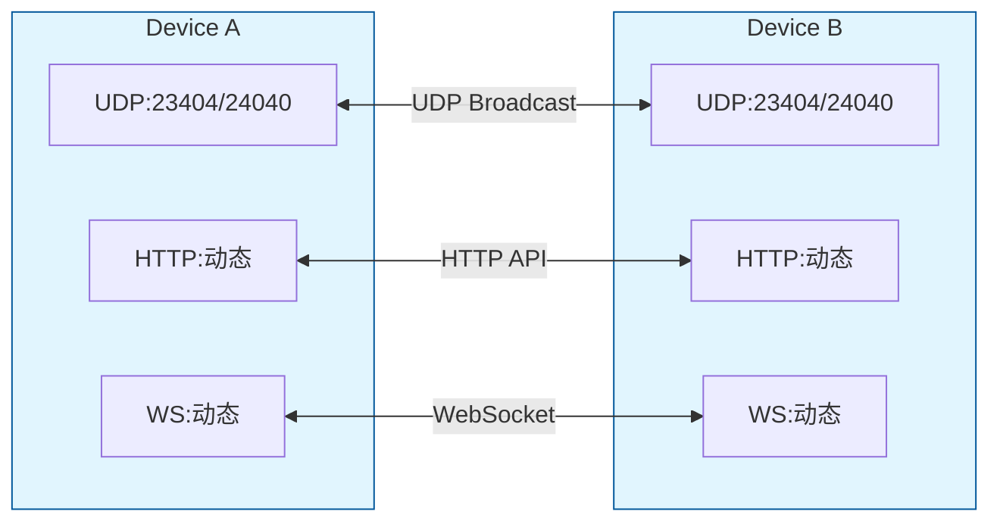
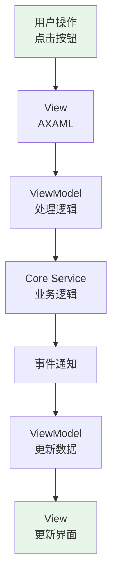
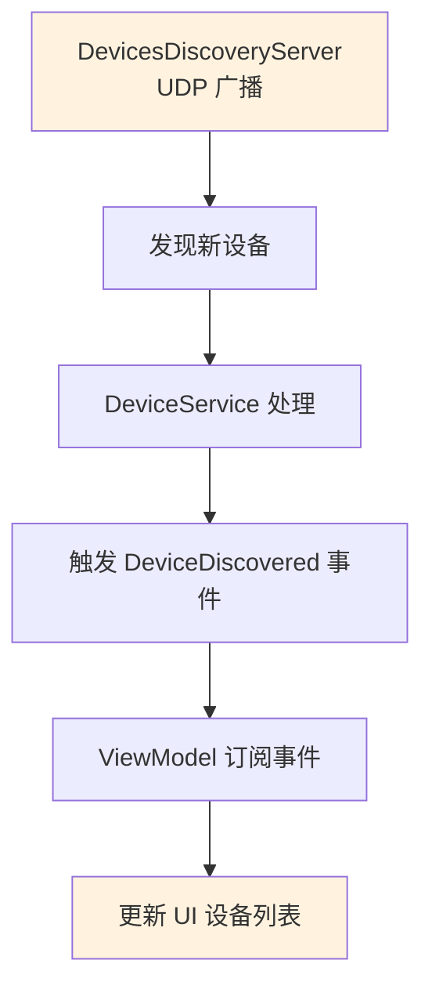
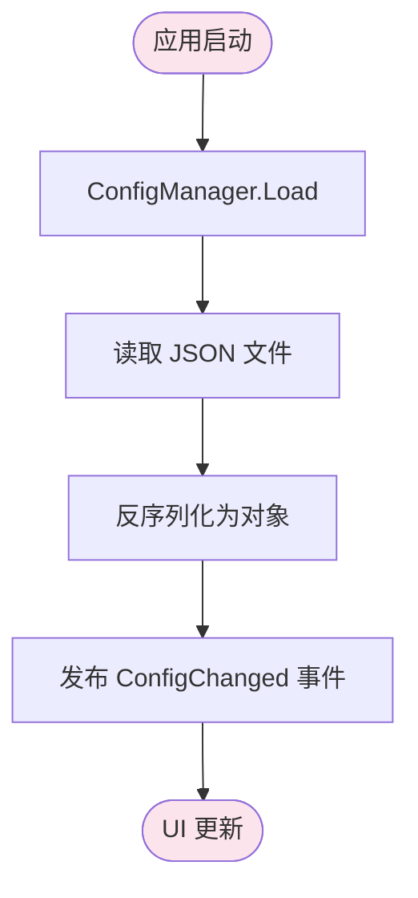

# KitX Dashboard 架构文档

## 文档信息

- **项目名称**: KitX Dashboard
- **文档版本**: v1.0
- **创建日期**: 2026-02-19
- **目的**: 描述 KitX Dashboard 的系统架构

---

## 1. 架构概述

### 架构核心（重要！务必遵循！）

1. 与KitX Core有关的业务逻辑放在Core中，接口放在Core.Contract中，前端（Dashboard）中只能放置与UI直接相关的逻辑
2. Dashboard中的对Core的调用必须使用DI容器通过接口调用
3. 尽可能使用全局EventService中的事件系统，以避免私有孤立事件造成逻辑冗余或是漏洞（如造成事件触发的无限循环）
4. **Task.Run 与 ITasksService 的使用原则：**
   - `KitX.Core.Tasks.TasksManager`（通过 `ITasksService` 接口访问）用于**业务逻辑任务**，提供统一的日志记录和异常处理
   - `System.Threading.Tasks.Task.Run()` 用于**内部基础设施任务**（如网络I/O、线程管理）和 **UI 辅助任务**（如动画）
   - **Core 内部**：可以使用 `TasksManager.Instance` 直接访问单例
   - **UI 层（Dashboard）**：必须通过 DI 容器获取 `ITasksService` 实例，**禁止直接使用 `TasksManager.Instance`**
   - 示例：
     ```csharp
     // ✅ Dashboard 中正确用法（通过 DI）
     _tasksService.RunTaskAsync(async () => { ... }, nameof(MyTask));

     // ❌ Dashboard 中错误用法（直接访问单例）
     TasksManager.Instance.RunTaskAsync(...);

     // ✅ Core 内部正确用法（可直接访问）
     TasksManager.Instance.RunTaskAsync(...);
     ```

### 1.1 设计目标

KitX Dashboard 采用 Core-UI 分离架构，主要目标如下：

1. **业务逻辑独立** - 将业务逻辑从 Dashboard 项目抽离到独立的 `KitX.Core` 项目
2. **接口定义清晰** - 在 `KitX.Core.Contract` 中定义所有业务接口
3. **依赖注入** - 使用 DI 容器管理依赖关系
4. **事件驱动** - 使用事件总线进行组件间通信
5. **可测试性** - Core 业务逻辑可独立测试

### 1.2 架构分层



---

## 2. 项目结构

### 2.1 解决方案结构

```
KitX.sln
├── KitX Clients/
│   ├── KitX Dashboard/              # UI 层 (Avalonia UI)
│   └── KitX Core/                  # 业务逻辑层
├── KitX Standard/
│   └── KitX Core Contracts/        # 接口定义层
└── KitX SDK/                        # SDK 和工具
```

### 2.2 Dashboard 项目结构

```
KitX Dashboard/
├── ViewModels/                      # 视图模型层
│   ├── MainWindowViewModel.cs
│   ├── HomePageViewModel.cs
│   ├── DevicesPageViewModel.cs
│   ├── PluginsPageViewModel.cs
│   └── SettingsPageViewModel.cs
├── Views/                           # 视图层
│   ├── MainWindow.axaml
│   ├── Pages/
│   │   ├── HomePage.axaml
│   │   ├── DevicesPage.axaml
│   │   ├── PluginsPage.axaml
│   │   └── SettingsPage.axaml
│   └── Controls/
├── Services/                        # UI 层服务
│   ├── UIStateService.cs          # UI 状态管理服务 (静态服务)
│   └── ServiceAdapters.cs        # 服务适配器
├── Converters/                      # 值转换器
├── App.axaml                        # 应用程序定义
└── App.axaml.cs                     # 应用程序代码
```

### 2.3 Core 项目结构

```
KitX.Core/
├── Configuration/                  # 配置管理
│   ├── ConfigManager.cs           # 实现 IConfigService
│   └── AppConfig.cs
├── Device/                         # 设备管理
│   ├── DeviceService.cs           # 实现 IDeviceService
│   ├── DevicesDiscoveryServer.cs  # 实现 IDeviceDiscoveryService
│   ├── DevicesServer.cs          # 实现 IDeviceServer
│   ├── DevicesOrganizer.cs
│   ├── PluginsServer.cs          # 实现 IPluginServer (位于 Device 目录)
│   ├── DeviceCase.cs
│   ├── ServerStatus.cs            # 服务器状态枚举
│   ├── NetworkHelper.cs          # 网络辅助类
│   └── OperatingSystemHelper.cs   # 操作系统辅助类
├── Plugin/                         # 插件管理
│   ├── PluginsManager.cs          # 实现 IPluginService
│   ├── PluginsServer.cs          # 实现 IPluginServer
│   └── PluginConnector.cs         # 实现 IPluginConnector
├── Security/                       # 安全管理
│   └── SecurityManager.cs         # 实现 ISecurityService
├── Activity/                       # 活动记录
│   └── ActivityManager.cs         # 实现 IActivityService
├── Statistics/                     # 统计服务
│   └── StatisticsManager.cs       # 实现 IStatisticsService
├── Workflow/                       # 工作流
│   └── WorkflowScriptService.cs   # 实现 IWorkflowService
├── Event/                          # 事件系统
│   ├── EventService.cs            # 实现 IEventService
│   ├── EventNames.cs              # 事件名称常量
│   └── EventArgs.cs               # 事件参数类
├── Task/                           # 任务调度
│   └── TasksManager.cs            # 实现 ITasksService
├── FileWatcher/                    # 文件监控
│   └── FileWatcherManager.cs      # 实现 IFileWatcherService
├── Hotkey/                         # 全局热键
│   └── KeyHookManager.cs          # 实现 IKeyHookService
├── Announcement/                   # 公告系统
│   └── AnnouncementManager.cs     # 实现 IAnnouncementService
└── DI/                             # 依赖注入
    └── CoreServiceCollectionExtensions.cs
```

---

## 3. 核心组件

### 3.1 配置管理 (Configuration)

**组件**: `ConfigManager`
**接口**: `IConfigService`

**功能**:
- 应用程序配置的加载、保存、热重载
- 插件配置、安全配置、市场配置管理
- 窗口、页面、Web、日志、IO、活动记录等完整配置体系

**数据结构**:
- `IAppConfig` - 完整应用配置 (包含 App, Windows, Pages, Web, Log, IO, Activity, Loaders)
- `IAppConf` - 应用基础配置
- `IWindowsConf` / `IMainWindowConf` - 窗口配置
- `IPagesConf` / `ISettingsPageConf` - 页面配置
- `IWebConf` - 网络配置
- `ILogConf` - 日志配置
- `IIOConf` - IO 配置
- `IActivityConf` - 活动记录配置
- `ILoadersConf` - 加载器配置
- `IAnnouncementConfig` - 公告配置
- `IPluginsConfig` - 插件配置
- `ISecurityConfig` - 安全配置
- `WindowState` 枚举 - 窗口状态
- `NavigationViewPaneDisplayMode` 枚举 - 导航显示模式

### 3.2 设备管理 (Device)

**组件**:
- `DeviceService` - 设备管理服务
- `DevicesDiscoveryServer` - UDP 发现服务
- `DevicesServer` - HTTP API 服务
- `PluginsServer` - WebSocket 插件服务器
- `DevicesOrganizer` - 设备组织器
- `DeviceCase` - 设备实例
- `ServerStatus` - 服务器状态枚举
- `NetworkHelper` - 网络辅助类
- `OperatingSystemHelper` - 操作系统辅助类

**接口**:
- `IDeviceService`
- `IDeviceDiscoveryService`
- `IDeviceServer`
- `IPluginServer`

**功能**:
- 设备发现 (UDP 广播)
- 设备认证和授权
- 设备间通信 (HTTP API)
- 插件 WebSocket 通信

### 3.3 插件管理 (Plugin)

**组件**:
- `PluginsManager` - 插件管理器
- `PluginsServer` - WebSocket 服务
- `PluginConnector` - 插件连接器

**接口**:
- `IPluginService`
- `IPluginServer`
- `IPluginConnector`

**功能**:
- 插件包 (KXP) 导入和安装
- 插件生命周期管理
- 插件通信桥接

### 3.4 安全管理 (Security)

**组件**: `SecurityManager`
**接口**: `ISecurityService`

**功能**:
- 设备密钥管理
- RSA/AES 加密解密
- 设备认证

### 3.5 活动记录 (Activity)

**组件**: `ActivityManager`
**接口**: `IActivityService`

**功能**:
- 应用活动记录
- 用户行为追踪

### 3.6 统计服务 (Statistics)

**组件**: `StatisticsManager`
**接口**: `IStatisticsService`

**功能**:
- 应用使用时长统计

---

## 4. 依赖注入

### 4.1 DI 容器选择

使用 **Microsoft.Extensions.DependencyInjection** (MS.DI):

**优点**:
- .NET 官方 DI 容器
- 轻量级、高性能
- 与 ASP.NET Core 生态集成良好

### 4.2 服务生命周期

| 服务类型 | 生命周期 | 说明 |
|----------|----------|------|
| IConfigService | Singleton | 全局配置，整个应用生命周期 |
| ISecurityService | Singleton | 安全管理，整个应用生命周期 |
| IPluginService | Singleton | 插件管理，整个应用生命周期 |
| IDeviceService | Singleton | 设备管理，整个应用生命周期 |
| IEventService | Singleton | 事件总线，整个应用生命周期 |
| ITasksService | Singleton | 任务调度，整个应用生命周期 |

### 4.3 服务注册

```csharp
public static IServiceCollection AddCoreServices(this IServiceCollection services)
{
    // 单例服务
    services.AddSingleton<IConfigService, ConfigManager>();
    services.AddSingleton<ISecurityService, SecurityManager>();
    services.AddSingleton<IPluginService, PluginsManager>();
    services.AddSingleton<IDeviceService, DeviceService>();
    // ...
    return services;
}
```

---

## 5. 事件系统

### 5.1 事件驱动架构

Core 层通过事件向 UI 层推送状态变化：

```csharp
// Core 层触发事件
DeviceDiscovered?.Invoke(this, new DeviceDiscoveredEventArgs
{
    DeviceInfo = deviceInfo
});

// UI 层订阅事件
_deviceService.DeviceDiscovered += OnDeviceDiscovered;
```

### 5.2 服务事件 (IService Events)

以下事件由各服务接口定义，直接订阅即可：

| 事件 | 说明 | 事件参数 |
|------|------|----------|
| DeviceDiscovered | 设备发现 | DeviceDiscoveredEventArgs |
| DeviceOffline | 设备离线 | DeviceOfflineEventArgs |
| MainDeviceChanged | 主设备变更 | MainDeviceChangedEventArgs |
| PluginStatusChanged | 插件状态变更 | PluginStatusChangedEventArgs |
| ConfigChanged | 配置变更 | ConfigChangedEventArgs |

### 5.3 事件总线事件 (IEventService Events)

通过 `IEventService.Publish(EventNames.XXX, args)` 发布的事件：

| 事件名称 | 说明 |
|----------|------|
| LanguageChanged | 语言变更 |
| GreetingTextIntervalUpdated | 问候文本间隔更新 |
| AppConfigChanged | 应用配置变更 |
| PluginsConfigChanged | 插件配置变更 |
| MicaOpacityChanged | Mica 透明度变更 |
| DevelopSettingsChanged | 开发者设置变更 |
| LogConfigUpdated | 日志配置更新 |
| ThemeConfigChanged | 主题配置变更 |
| UseStatisticsChanged | 使用统计变更 |
| DevicesServerPortChanged | 设备服务器端口变更 |
| PluginsServerPortChanged | 插件服务器端口变更 |
| OnActivitiesUpdated | 活动记录更新 |
| OnReceiveCancelExchangingDeviceKey | 取消交换设备密钥 |
| OnExiting | 退出事件 |
| OnReceivingDeviceInfo | 接收设备信息 |
| OnConfigHotReloaded | 配置热重载 |
| OnAcceptingDeviceKey | 接受设备密钥 |

### 5.4 过时的 API (Legacy / Obsolete)

> **注意**: 以下 API 已标记为 `[Obsolete]`，不建议在新代码中使用。

**EventService 静态类** (已过时):
- 旧的 `EventService` 静态类及其静态事件 (如 `EventService.LanguageChanged`, `EventService.AppConfigChanged` 等) 已过时
- 静态方法 `EventService.Invoke(string eventName, object[]? objects)` 已标记为废弃

**推荐的替代方案**:
1. 通过依赖注入获取 `IEventService` 实例
2. 使用 `EventNames` 常量类定义事件名称
3. 使用 `IEventService.Publish(EventNames.XXX, args)` 发布事件

**迁移示例**:
```csharp
// ❌ 过时的写法 (不要使用)
EventService.LanguageChanged.Invoke();

// ✅ 推荐的写法
var eventService = App.GetService<IEventService>();
eventService.Publish(EventNames.LanguageChanged, EventArgs.Empty);
```

---

## 6. 网络架构

### 6.1 通信协议

> ⚠️ 注意：以下端口为 Legacy 实际值，与旧文档（5231/5232/5233）不符，已按实际代码修正。

| 服务 | 协议 | 默认端口 | 说明 |
|------|------|----------|------|
| 设备发现（发送） | UDP | 23404 | AppConfig.Web.UdpPortSend |
| 设备发现（接收） | UDP | 24040 | AppConfig.Web.UdpPortReceive |
| 设备服务器 | HTTP | 动态（0） | 运行时分配可用端口；AppConfig.Web.UserSpecifiedDevicesServerPort |
| 插件服务器 | WebSocket | 动态（0） | 运行时分配可用端口；AppConfig.Web.UserSpecifiedPluginsServerPort |

### 6.2 网络拓扑



---

## 7. 数据流

### 7.1 用户交互数据流



### 7.2 设备发现数据流



---

## 8. 安全机制

### 8.1 加密通信

- 使用 RSA 进行密钥交换
- 使用 AES 进行数据加密
- 设备间通信全部加密

### 8.2 设备认证

- 基于公钥基础设施 (PKI)
- 设备密钥管理
- 授权设备列表

---

## 9. 配置管理

### 9.1 配置文件

| 配置文件 | 说明 |
|----------|------|
| AppConfig.json | 应用配置 |
| PluginsConfig.json | 插件配置 |
| SecurityConfig.json | 安全配置 |

### 9.2 配置加载流程



---

## 10. UI 状态管理

### 10.1 UIStateService

`UIStateService` 是 Dashboard 项目特有的 UI 状态管理服务，**不属于 Core 层**。它负责管理 UI 相关的共享状态：

**功能**:
- 设备列表状态 (`DeviceCases`)
- 工作流列表状态 (`WorkflowCases`)
- 插件列表状态 (`PluginInfos`)
- 窗口引用管理 (`MainWindow`, `PluginsLaunchWindow`, `Windows`)
- 窗口显示功能 (`ShowWindow<T>`)

**设计说明**:
- 使用静态类实现，因为需要被 ViewModels 和 Code-behind 共同访问
- 包含 Avalonia UI 特定类型（如 `Window`），不适合放在 Core 项目中
- 是一个临时方案，未来可能考虑重构为 DI 单例服务

**使用示例**:
```csharp
// ViewModel 中访问 UI 状态
var devices = UIStateService.DeviceCases;
var plugins = UIStateService.PluginInfos;

// Code-behind 中设置主窗口引用
UIStateService.MainWindow = this;

// 显示窗口
UIStateService.ShowWindow(new PluginDetailWindow());
```

---

## 11. 扩展性

### 10.1 添加新服务

1. 在 `KitX.Core.Contract` 定义接口
2. 在 `KitX.Core` 实现接口
3. 在 `CoreServiceCollectionExtensions` 注册

### 10.2 添加新前端

未来可支持 CLI 版本：
- 引用 `KitX.Core.Contract`
- 引用 `KitX.Core`
- 使用相同的服务接口

---

## 11. 附录

### 11.1 术语表

| 术语 | 说明 |
|------|------|
| Core 层 | 业务逻辑层 |
| UI 层 | 用户界面层 |
| DI | 依赖注入 |
| 接口隔离 | UI 层只依赖接口 |
| 进程内通信 | 同一进程内方法调用 |

### 11.2 参考资料

- [Microsoft.Extensions.DependencyInjection](https://docs.microsoft.com/dotnet/core/extensions/dependency-injection)
- [Avalonia UI](https://avaloniaui.net/)
- [ReactiveUI](https://reactiveui.net/)

---

**文档结束**

*本文档描述了 KitX Dashboard 的系统架构。*
